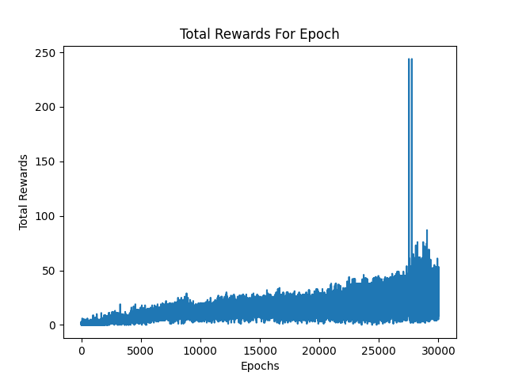

# Breakout: Deep Reinforcement Learning with DQN

## Project Overview

This project implements a Deep Q-Network (DQN) to solve the OpenAI Breakout environment using deep reinforcement learning techniques. Developed in Python with PyTorch, this implementation leverages a custom environment wrapper, experience replay, and target networks to train the model effectively. The model is optimized for GPU training, ensuring efficient computation and faster convergence.

## Features

- **Custom Environment Wrapper:** Handles frame processing, grayscale conversion, resizing, and action repetition for more efficient training.
- **Replay Buffer:** Stores transitions and samples mini-batches for training, enhancing learning stability.
- **DQN Architecture:** Utilizes convolutional layers followed by fully connected layers, designed to process the input frames and output action values.
- **Target Network:** Stabilizes the training process by using a separate target network for the Q-value updates.
- **GPU Support:** The model is optimized for GPU usage, allowing for faster training times.

## Installation

1. **Clone the Repository:**

   ```bash
   git clone https://github.com/sameerNajjar/OpenAI-Breakout
   cd breakout-dqn
   ```

2. **Set Up the Environment:**

   - Install [Anaconda](https://www.anaconda.com/) if you don't have it installed.
   - Create a new environment and install dependencies:
     ```bash
     conda create --name breakout-dqn python=3.9
     conda activate breakout-dqn
     conda install pytorch torchvision torchaudio cudatoolkit=11.3 -c pytorch
     conda install -c conda-forge gymnasium opencv matplotlib
     ```

3. **Run the Training Script:**
   ```bash
   python main.py
   ```

## How It Works

- **Training:** The model is trained using the DQN algorithm, where it learns to play Breakout by interacting with the environment and updating its policy based on the rewards received.
- **Evaluation:** After training, the model can be evaluated, and gameplay videos can be recorded to visualize the agent's performance, the pre-trained model is saved in trained model folder.

## Results

The model's performance improves over time, as indicated by the increasing rewards in each epoch. A plot of the total rewards per epoch is generated after training.

## Usage

- **Train the Model:** The training process can be initiated by running `main.py`, which trains the DQN model and saves the trained model periodically.
- **Record Gameplay:** The trained agent's performance can be recorded using the `record_frames` function, which saves a video of the agent playing Breakout.

## Results (trained on rtx 4060 which is limited by only 8gb vram)


